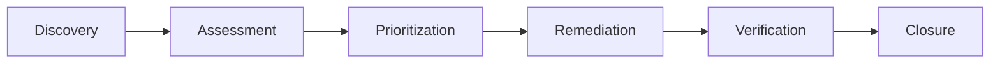

# 🚀 CloudMind Comprehensive User Guide

## 📋 Table of Contents

1. [Getting Started](#getting-started)
2. [Authentication & User Management](#authentication--user-management)
3. [Dashboard Overview](#dashboard-overview)
4. [Cost Analysis & Optimization](#cost-analysis--optimization)
5. [Security & Compliance](#security--compliance)
6. [Infrastructure Management](#infrastructure-management)
7. [AI-Powered Insights](#ai-powered-insights)
8. [Reporting & Analytics](#reporting--analytics)
9. [Advanced Features](#advanced-features)
10. [Troubleshooting](#troubleshooting)
11. [API Reference](#api-reference)
12. [Best Practices](#best-practices)

---

## 🎯 Getting Started

### Prerequisites
- Modern web browser (Chrome, Firefox, Safari, Edge)
- CloudMind account (contact your administrator)
- Access to your cloud infrastructure

### Quick Start Guide

#### 1. First Login
```bash
# Navigate to CloudMind
https://your-cloudmind-instance.com

# Login with your credentials
Email: your-email@company.com
Password: your-secure-password
```

#### 2. Complete Onboarding
1. **Profile Setup**: Update your profile information
2. **Project Creation**: Create your first project
3. **Cloud Connection**: Connect your cloud accounts
4. **Initial Scan**: Run your first cost and security analysis

#### 3. Dashboard Overview
After login, you'll see the main dashboard with:
- **Cost Summary**: Current spending and trends
- **Security Score**: Overall security posture
- **Infrastructure Health**: Resource status and utilization
- **Recent Insights**: AI-generated recommendations

---

## 🔐 Authentication & User Management

### User Roles & Permissions

| Role | Permissions | Use Case |
|------|-------------|----------|
| **Master User** | Full system access | System administrators |
| **Admin** | Project management, user management | Team leads |
| **Manager** | Cost analysis, reporting | Finance managers |
| **Engineer** | Infrastructure management | DevOps engineers |
| **Viewer** | Read-only access | Stakeholders |

### Multi-Factor Authentication (MFA)

#### Setup MFA
1. Go to **Settings** → **Security**
2. Click **Enable MFA**
3. Scan QR code with authenticator app
4. Enter verification code
5. Save backup codes

#### Backup Codes
```bash
# Store these codes securely
Backup Code 1: ABCD-EFGH-IJKL-MNOP
Backup Code 2: QRST-UVWX-YZAB-CDEF
Backup Code 3: GHIJ-KLMN-OPQR-STUV
```

### Password Security
- **Minimum Length**: 12 characters
- **Requirements**: Uppercase, lowercase, numbers, symbols
- **Expiration**: 90 days
- **History**: Cannot reuse last 5 passwords

---

## 📊 Dashboard Overview

### Main Dashboard Components

#### 1. Cost Metrics
```typescript
// Example cost data structure
{
  totalCost: 15000,
  monthlyChange: 5.2,
  savings: 2500,
  breakdown: {
    EC2: 8000,
    RDS: 4000,
    S3: 3000
  }
}
```

#### 2. Security Metrics
```typescript
// Example security data structure
{
  score: 95,
  vulnerabilities: 3,
  compliance: 'SOC2',
  lastScan: '2024-01-15T10:30:00Z'
}
```

#### 3. Infrastructure Metrics
```typescript
// Example infrastructure data structure
{
  resources: 150,
  health: 'excellent',
  utilization: 78,
  alerts: 2
}
```

### Real-Time Updates
- **WebSocket Connection**: Live data updates
- **Auto-refresh**: Every 30 seconds
- **Manual Refresh**: Click refresh button
- **Period Selection**: 7d, 30d, 90d, 1y

---

## 💰 Cost Analysis & Optimization

### Creating Cost Analysis

#### Step 1: New Analysis
1. Navigate to **Cost Analysis**
2. Click **New Analysis**
3. Fill in details:
   ```json
   {
     "name": "Monthly Cost Review",
     "project": "Production Environment",
     "dateRange": "2024-01-01 to 2024-01-31",
     "services": ["EC2", "RDS", "S3", "Lambda"],
     "regions": ["us-east-1", "us-west-2"]
   }
   ```

#### Step 2: AI-Powered Insights
The system automatically generates:
- **Cost Anomalies**: Unusual spending patterns
- **Optimization Opportunities**: Potential savings
- **Trend Analysis**: Spending patterns over time
- **Forecasting**: Future cost predictions

#### Step 3: Optimization Actions
```typescript
// Example optimization recommendations
{
  recommendations: [
    {
      type: "reserved_instances",
      potential_savings: 1500,
      effort: "low",
      description: "Convert on-demand instances to reserved"
    },
    {
      type: "rightsizing",
      potential_savings: 800,
      effort: "medium",
      description: "Downsize over-provisioned instances"
    }
  ]
}
```

### Cost Optimization Strategies

#### 1. Reserved Instances
```bash
# Calculate savings
Current Cost: $1,000/month (on-demand)
Reserved Cost: $600/month (1-year term)
Savings: $400/month (40% reduction)
```

#### 2. Spot Instances
```bash
# Use cases for spot instances
- Batch processing
- Data analysis
- Development/testing
- Non-critical workloads
```

#### 3. Auto Scaling
```yaml
# Example auto-scaling configuration
AutoScalingGroup:
  MinCapacity: 2
  MaxCapacity: 10
  TargetCPUUtilization: 70%
  ScaleUpCooldown: 300s
  ScaleDownCooldown: 300s
```

### Cost Alerts & Budgets

#### Setting Up Budgets
1. Go to **Cost Analysis** → **Budgets**
2. Click **Create Budget**
3. Configure:
   ```json
   {
     "name": "Monthly Production Budget",
     "amount": 20000,
     "period": "monthly",
     "alerts": [
       { "threshold": 80, "type": "warning" },
       { "threshold": 100, "type": "critical" }
     ]
   }
   ```

#### Alert Notifications
- **Email**: Daily/weekly summaries
- **Slack**: Real-time alerts
- **SMS**: Critical budget alerts
- **Webhook**: Custom integrations

---

## 🔒 Security & Compliance

### Security Scanning

#### Automated Scans
```typescript
// Scan configuration
{
  scanType: "comprehensive",
  frequency: "daily",
  targets: ["EC2", "RDS", "S3", "IAM"],
  compliance: ["SOC2", "HIPAA", "PCI-DSS"]
}
```

#### Manual Scans
1. Go to **Security** → **Scans**
2. Click **New Scan**
3. Select scan type:
   - **Vulnerability Scan**: Security weaknesses
   - **Compliance Scan**: Regulatory compliance
   - **Configuration Scan**: Best practices
   - **AI-Enhanced Scan**: Advanced threat detection

### Vulnerability Management

#### Vulnerability Lifecycle


#### Severity Levels
| Level | Description | Response Time |
|-------|-------------|---------------|
| **Critical** | Immediate action required | 24 hours |
| **High** | Action required soon | 72 hours |
| **Medium** | Plan for remediation | 1 week |
| **Low** | Monitor and review | 1 month |

### Compliance Frameworks

#### SOC2 Compliance
```typescript
// SOC2 control mapping
{
  controls: {
    "CC6.1": "Logical Access Security",
    "CC6.2": "Access to Data and Systems",
    "CC6.3": "Identification and Authentication",
    "CC6.4": "User Account Management",
    "CC6.5": "Protection of Security Assets"
  }
}
```

#### HIPAA Compliance
```typescript
// HIPAA requirements
{
  requirements: {
    "164.308": "Administrative Safeguards",
    "164.310": "Physical Safeguards",
    "164.312": "Technical Safeguards",
    "164.314": "Organizational Requirements"
  }
}
```

### Security Best Practices

#### 1. Access Control
```bash
# Principle of least privilege
- Grant minimum required permissions
- Regular access reviews
- Temporary access with expiration
- Multi-factor authentication
```

#### 2. Data Protection
```bash
# Encryption at rest and in transit
- AES-256 encryption for data at rest
- TLS 1.3 for data in transit
- Key rotation every 90 days
- Secure key management
```

#### 3. Monitoring & Alerting
```yaml
# Security monitoring configuration
Monitoring:
  - Failed login attempts
  - Unusual access patterns
  - Configuration changes
  - Data access logs
  - Network traffic anomalies
```

---

## 🏗️ Infrastructure Management

### Resource Discovery

#### Automatic Discovery
```typescript
// Discovery configuration
{
  providers: ["AWS", "Azure", "GCP"],
  regions: ["us-east-1", "us-west-2", "eu-west-1"],
  services: ["EC2", "RDS", "S3", "Lambda", "Kubernetes"]
}
```

#### Manual Resource Addition
1. Go to **Infrastructure** → **Resources**
2. Click **Add Resource**
3. Select resource type and provider
4. Enter connection details

### Resource Optimization

#### AI-Powered Recommendations
```typescript
// Optimization recommendations
{
  recommendations: [
    {
      type: "rightsizing",
      resource: "i3.large",
      current: { cpu: 20, memory: 30 },
      recommended: "i3.medium",
      savings: 200
    },
    {
      type: "scheduling",
      resource: "dev-instance",
      schedule: "weekdays-only",
      savings: 150
    }
  ]
}
```

#### Auto Scaling Policies
```yaml
# Auto scaling configuration
AutoScalingPolicy:
  - name: "CPU-based-scaling"
    metric: "CPUUtilization"
    threshold: 70
    cooldown: 300
    min_capacity: 2
    max_capacity: 10
```

### Infrastructure Monitoring

#### Health Checks
```typescript
// Health check configuration
{
  checks: [
    {
      name: "Database Connectivity",
      type: "tcp",
      port: 5432,
      interval: 30,
      timeout: 5
    },
    {
      name: "Web Application",
      type: "http",
      url: "https://app.example.com/health",
      interval: 60,
      timeout: 10
    }
  ]
}
```

#### Performance Metrics
- **CPU Utilization**: Target 70-80%
- **Memory Usage**: Target 80-85%
- **Disk I/O**: Monitor for bottlenecks
- **Network**: Bandwidth and latency

---

## 🤖 AI-Powered Insights

### AI Analysis Types

#### 1. Cost Analysis
```typescript
// AI cost insights
{
  insights: [
    {
      type: "anomaly_detection",
      description: "Unusual spike in EC2 costs",
      confidence: 0.95,
      recommendation: "Investigate recent deployments"
    },
    {
      type: "trend_prediction",
      description: "Costs expected to increase 15%",
      confidence: 0.88,
      recommendation: "Implement cost controls"
    }
  ]
}
```

#### 2. Security Analysis
```typescript
// AI security insights
{
  insights: [
    {
      type: "threat_detection",
      description: "Potential brute force attack",
      confidence: 0.92,
      recommendation: "Enable additional monitoring"
    },
    {
      type: "vulnerability_assessment",
      description: "Outdated SSL certificates",
      confidence: 0.87,
      recommendation: "Update certificates"
    }
  ]
}
```

#### 3. Infrastructure Analysis
```typescript
// AI infrastructure insights
{
  insights: [
    {
      type: "performance_optimization",
      description: "Database connection pool exhausted",
      confidence: 0.89,
      recommendation: "Increase connection pool size"
    },
    {
      type: "capacity_planning",
      description: "Storage usage approaching limit",
      confidence: 0.94,
      recommendation: "Scale storage or cleanup"
    }
  ]
}
```

### AI Model Training

#### Custom Model Training
```python
# Example: Custom cost prediction model
from cloudmind.ai import AIModel

model = AIModel(
    name="custom_cost_predictor",
    type="regression",
    features=["cpu_usage", "memory_usage", "network_io"],
    target="cost_prediction"
)

# Train with historical data
model.train(training_data)

# Deploy for predictions
model.deploy()
```

#### Model Performance Monitoring
```typescript
// Model performance metrics
{
  metrics: {
    accuracy: 0.94,
    precision: 0.92,
    recall: 0.89,
    f1_score: 0.90
  },
  alerts: {
    accuracy_threshold: 0.85,
    drift_detection: true
  }
}
```

---

## 📈 Reporting & Analytics

### Standard Reports

#### 1. Cost Reports
```typescript
// Cost report structure
{
  report: {
    period: "2024-01-01 to 2024-01-31",
    total_cost: 15000,
    breakdown: {
      by_service: { EC2: 8000, RDS: 4000, S3: 3000 },
      by_region: { "us-east-1": 10000, "us-west-2": 5000 },
      by_project: { "production": 12000, "development": 3000 }
    },
    trends: [
      { date: "2024-01-01", cost: 500 },
      { date: "2024-01-02", cost: 480 },
      // ... more data points
    ]
  }
}
```

#### 2. Security Reports
```typescript
// Security report structure
{
  report: {
    period: "2024-01-01 to 2024-01-31",
    overall_score: 95,
    vulnerabilities: {
      critical: 0,
      high: 2,
      medium: 5,
      low: 8
    },
    compliance: {
      SOC2: "Compliant",
      HIPAA: "Compliant",
      PCI_DSS: "Non-Compliant"
    }
  }
}
```

#### 3. Infrastructure Reports
```typescript
// Infrastructure report structure
{
  report: {
    period: "2024-01-01 to 2024-01-31",
    total_resources: 150,
    health_score: 92,
    utilization: {
      cpu: 78,
      memory: 65,
      storage: 45,
      network: 30
    },
    recommendations: [
      "Scale up 3 instances",
      "Add 2 load balancers",
      "Optimize database queries"
    ]
  }
}
```

### Custom Reports

#### Creating Custom Reports
1. Go to **Reports** → **Custom Reports**
2. Click **Create Report**
3. Select data sources:
   ```json
   {
     "data_sources": [
       "cost_analysis",
       "security_scans",
       "infrastructure_metrics"
     ],
     "filters": {
       "date_range": "last_30_days",
       "projects": ["production", "staging"],
       "regions": ["us-east-1"]
     },
     "visualizations": [
       "line_chart",
       "pie_chart",
       "bar_chart",
       "table"
     ]
   }
   ```

#### Report Scheduling
```typescript
// Report schedule configuration
{
  schedule: {
    frequency: "weekly",
    day: "monday",
    time: "09:00",
    recipients: ["admin@company.com", "finance@company.com"],
    format: "pdf"
  }
}
```

### Data Export

#### Export Formats
- **CSV**: Raw data for analysis
- **PDF**: Formatted reports
- **Excel**: Interactive spreadsheets
- **JSON**: API integration

#### Export Configuration
```typescript
// Export configuration
{
  export: {
    format: "csv",
    include_charts: true,
    include_insights: true,
    date_range: "last_30_days",
    compression: "zip"
  }
}
```

---

## ⚙️ Advanced Features

### API Integration

#### REST API Usage
```bash
# Authentication
curl -X POST https://api.cloudmind.com/auth/login \
  -H "Content-Type: application/json" \
  -d '{"email": "user@company.com", "password": "password"}'

# Get cost analysis
curl -X GET https://api.cloudmind.com/api/v1/cost/analysis \
  -H "Authorization: Bearer YOUR_TOKEN" \
  -H "Content-Type: application/json"
```

#### WebSocket Real-time Updates
```javascript
// WebSocket connection
const ws = new WebSocket('wss://api.cloudmind.com/ws');

ws.onmessage = (event) => {
  const data = JSON.parse(event.data);
  
  switch(data.type) {
    case 'cost_update':
      updateCostDisplay(data.cost);
      break;
    case 'security_alert':
      showSecurityAlert(data.alert);
      break;
    case 'infrastructure_status':
      updateInfrastructureStatus(data.status);
      break;
  }
};
```

### Webhook Integration

#### Webhook Configuration
```json
{
  "webhook": {
    "url": "https://your-app.com/webhook",
    "events": [
      "cost_threshold_exceeded",
      "security_vulnerability_detected",
      "infrastructure_health_degraded"
    ],
    "secret": "your-webhook-secret",
    "retry_count": 3,
    "timeout": 30
  }
}
```

### Custom Dashboards

#### Dashboard Builder
1. Go to **Dashboards** → **Custom**
2. Click **Create Dashboard**
3. Add widgets:
   ```typescript
   // Widget configuration
   {
     widgets: [
       {
         type: "cost_chart",
         title: "Monthly Cost Trend",
         size: "large",
         data_source: "cost_analysis",
         filters: { period: "last_12_months" }
       },
       {
         type: "security_score",
         title: "Security Overview",
         size: "medium",
         data_source: "security_scans"
       },
       {
         type: "infrastructure_map",
         title: "Resource Map",
         size: "large",
         data_source: "infrastructure"
       }
     ]
   }
   ```

---

## 🔧 Troubleshooting

### Common Issues

#### 1. Login Problems
```bash
# Check browser console for errors
F12 → Console → Look for error messages

# Clear browser cache
Ctrl+Shift+Delete → Clear cache and cookies

# Try incognito mode
Ctrl+Shift+N → Test login
```

#### 2. Data Not Loading
```bash
# Check network connectivity
ping api.cloudmind.com

# Verify API status
https://status.cloudmind.com

# Check browser network tab
F12 → Network → Look for failed requests
```

#### 3. Performance Issues
```bash
# Clear browser cache
Ctrl+Shift+Delete → Clear cache

# Disable browser extensions
Test in incognito mode

# Check system resources
Task Manager → Performance tab
```

### Error Messages

#### Common Error Codes
| Code | Description | Solution |
|------|-------------|----------|
| **401** | Unauthorized | Check credentials, refresh token |
| **403** | Forbidden | Contact administrator for permissions |
| **404** | Not Found | Verify URL, check resource exists |
| **500** | Server Error | Contact support, check status page |
| **503** | Service Unavailable | Wait and retry, check maintenance |

#### Debug Information
```typescript
// Enable debug mode
localStorage.setItem('debug', 'true');

// Check browser console
console.log('Debug information:', {
  userAgent: navigator.userAgent,
  screenSize: `${screen.width}x${screen.height}`,
  timezone: Intl.DateTimeFormat().resolvedOptions().timeZone,
  language: navigator.language
});
```

### Support Resources

#### Documentation
- **User Guide**: This document
- **API Documentation**: `/docs/api`
- **Video Tutorials**: `/docs/tutorials`
- **Best Practices**: `/docs/best-practices`

#### Support Channels
- **Email**: support@cloudmind.com
- **Chat**: In-app chat support
- **Phone**: +1-800-CLOUD-MIND
- **Slack**: #cloudmind-support

---

## 📚 API Reference

### Authentication

#### Login
```http
POST /api/v1/auth/login
Content-Type: application/json

{
  "email": "user@company.com",
  "password": "password"
}
```

#### Response
```json
{
  "success": true,
  "data": {
    "access_token": "eyJhbGciOiJIUzI1NiIsInR5cCI6IkpXVCJ9...",
    "refresh_token": "eyJhbGciOiJIUzI1NiIsInR5cCI6IkpXVCJ9...",
    "user": {
      "id": "123",
      "email": "user@company.com",
      "role": "admin"
    }
  }
}
```

### Cost Analysis

#### Get Cost Analysis
```http
GET /api/v1/cost/analysis
Authorization: Bearer YOUR_TOKEN
```

#### Response
```json
{
  "success": true,
  "data": {
    "total_cost": 15000,
    "breakdown": {
      "EC2": 8000,
      "RDS": 4000,
      "S3": 3000
    },
    "trends": [
      {
        "date": "2024-01-01",
        "cost": 500
      }
    ]
  }
}
```

### Security Scans

#### Get Security Scans
```http
GET /api/v1/security/scans
Authorization: Bearer YOUR_TOKEN
```

#### Response
```json
{
  "success": true,
  "data": {
    "scans": [
      {
        "id": "123",
        "type": "vulnerability",
        "status": "completed",
        "score": 95,
        "vulnerabilities": 3
      }
    ]
  }
}
```

### Infrastructure

#### Get Infrastructure
```http
GET /api/v1/infrastructure
Authorization: Bearer YOUR_TOKEN
```

#### Response
```json
{
  "success": true,
  "data": {
    "resources": [
      {
        "id": "i-1234567890abcdef0",
        "type": "EC2",
        "status": "running",
        "utilization": {
          "cpu": 75,
          "memory": 60,
          "disk": 45
        }
      }
    ],
    "health_score": 92
  }
}
```

---

## 🎯 Best Practices

### Cost Optimization

#### 1. Regular Reviews
- **Weekly**: Check for anomalies
- **Monthly**: Comprehensive analysis
- **Quarterly**: Strategic planning

#### 2. Tagging Strategy
```json
{
  "tags": {
    "Environment": ["production", "staging", "development"],
    "Project": ["web-app", "api", "database"],
    "Team": ["frontend", "backend", "devops"],
    "CostCenter": ["engineering", "marketing", "sales"]
  }
}
```

#### 3. Budget Management
- Set realistic budgets
- Monitor spending trends
- Implement alerts early
- Regular budget reviews

### Security

#### 1. Access Management
- Use least privilege principle
- Regular access reviews
- Implement MFA everywhere
- Monitor access patterns

#### 2. Compliance
- Regular compliance scans
- Document control procedures
- Train team on requirements
- Maintain audit trails

#### 3. Monitoring
- Set up comprehensive logging
- Monitor for anomalies
- Regular security assessments
- Incident response planning

### Infrastructure

#### 1. Resource Management
- Regular resource audits
- Implement auto-scaling
- Use appropriate instance types
- Monitor utilization

#### 2. Performance
- Set up monitoring
- Optimize based on metrics
- Plan for growth
- Regular performance reviews

#### 3. Reliability
- Implement redundancy
- Test disaster recovery
- Monitor health metrics
- Regular maintenance

### Data Management

#### 1. Data Retention
```json
{
  "retention_policy": {
    "cost_data": "7_years",
    "security_logs": "3_years",
    "audit_logs": "7_years",
    "performance_metrics": "1_year"
  }
}
```

#### 2. Data Privacy
- Encrypt sensitive data
- Implement access controls
- Regular privacy audits
- Compliance with regulations

#### 3. Backup Strategy
- Regular automated backups
- Test restore procedures
- Multiple backup locations
- Document recovery procedures

---

## 🎉 Conclusion

This comprehensive user guide covers all aspects of CloudMind. For additional support:

- **Documentation**: Visit `/docs` for detailed guides
- **Support**: Contact support@cloudmind.com
- **Community**: Join our user community forum
- **Training**: Schedule personalized training sessions

**Happy Cloud Engineering! 🚀** 